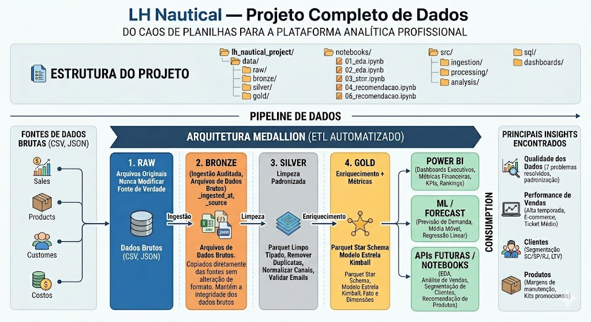
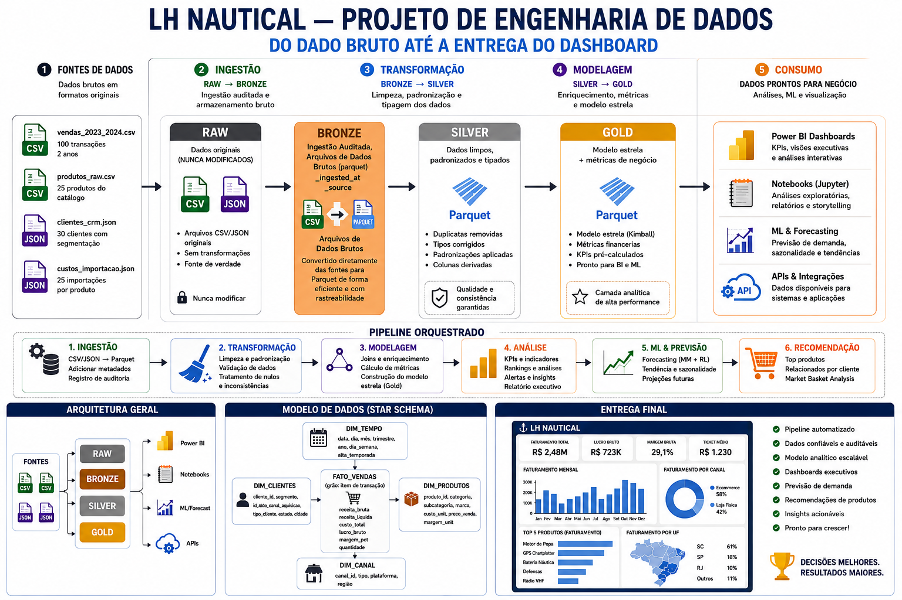

# LH Nautical — Projeto Completo de Dados
### Do Caos de Planilhas à Plataforma Analítica Profissional

---

## Sobre a Empresa

A **LH Nautical** é uma empresa líder no varejo de peças e acessórios para embarcações,
operando em um modelo híbrido com **loja física em Florianópolis** e um
**e-commerce de alcance nacional**.

Recentemente, a empresa viveu um crescimento acelerado que trouxe grandes desafios
operacionais e analíticos — e foi nesse contexto que este projeto nasceu.

---

## O Problema: O Caos dos Dados

> *"A diretoria quer usar Inteligência Artificial para prever vendas, mas hoje não
> consegue nem consolidar o faturamento do dia."*

Antes deste projeto, a LH Nautical vivia o que chamamos de **"caos dos dados"**:

| Problema | Impacto |
|---|---|
| Controle de estoque em planilhas manuais e "sujas" | Decisões baseadas em dados incorretos |
| E-commerce e sistema financeiro sem integração | Impossível ter visão consolidada do negócio |
| Dados espalhados em múltiplos formatos (CSV, JSON) | Análises manuais lentas e propensas a erros |
| Qualidade dos dados crítica (datas erradas, preços como texto, e-mails inválidos) | Relatórios não confiáveis |

---

## As Pessoas Por Trás do Projeto

Três perfis centrais guiaram todas as decisões deste trabalho:

**Gabriel Santos — Tech Lead**
> *"Valorizo mais a organização e a explicação do que o código rodando sem eu entender nada."*

O mentor técnico que exige clareza, documentação e raciocínio bem estruturado.
Tudo aqui foi pensado para que qualquer pessoa do time consiga entender e dar continuidade.

**Marina Costa — Gerente de Negócios**
Focada em resultados práticos: margens de lucro, performance de vendas e oportunidades de crescimento.
Os dashboards e relatórios foram desenhados para responder diretamente às perguntas dela.

**Sr. Almir — Fundador**
Perfil old school, desconfia de tecnologia e precisa ser convencido por **dados sólidos e análises precisas**.
Por isso, cada insight vem acompanhado de evidências claras nos dados.

---

## A Missão

Atuar como o profissional de dados que transformará esse cenário.

Recebemos quatro bases de dados brutas (vendas, produtos, clientes e custos de importação)
e a missão foi realizar desde a **limpeza e organização dos dados** (Engenharia de Dados)
até a **geração de insights preditivos e sistemas de recomendação** (Ciência de Dados).

As entregas foram organizadas em seis frentes:

| # | Frente | O que foi feito |
|---|--------|-----------------|
| 1 | **EDA** | Mapeamento de todos os problemas de qualidade dos dados |
| 2 | **Tratamento de Dados** | Limpeza, padronização e organização em camadas |
| 3 | **Análise de Vendas** | KPIs financeiros, faturamento mensal, margens e alertas |
| 4 | **Análise de Clientes** | Ranking, distribuição geográfica e concentração de risco |
| 5 | **Previsão de Demanda** | Projeção de faturamento para os próximos meses |
| 6 | **Sistema de Recomendação** | Produtos mais populares e pares frequentes (cross-sell) |

---

## Como o Projeto Funciona (Para Quem Não é da Área)

Imagine os dados como uma **matéria-prima que precisa ser refinada antes de virar produto final**.
Este projeto usa a **Arquitetura Medallion**, que processa os dados em camadas, como uma linha de produção:

```
Dados Brutos  -->  Bronze  -->  Silver  -->  Gold  -->  Relatórios e Dashboards
(bagunçados)      (cópia       (limpos e    (prontos
                  segura)      padroniz.)   para análise)
```

**Bronze:** Cópia exata dos arquivos originais. Nunca modificamos a fonte — assim sempre podemos rastrear de onde cada número veio.

**Silver:** Aqui acontece a limpeza: datas no formato certo, preços convertidos de texto para número, categorias padronizadas, localização dos clientes extraída corretamente.

**Gold:** Os dados "prontos para uso", organizados no modelo que os analistas e o Power BI consomem, já com métricas financeiras calculadas (receita, custo, lucro, margem).

---

## Visão Geral da Arquitetura



*Pipeline completo: das fontes brutas (CSV e JSON) até os dashboards executivos e modelos de previsão.*

---

## Pipeline Detalhado — Do Dado Bruto à Entrega



*Fluxo orquestrado com ingestão, transformação, modelagem em estrela (star schema) e entrega final.*

---

## Problemas de Qualidade Encontrados (EDA)

Ao explorar os dados brutos, identificamos **7 problemas de qualidade** que precisavam ser resolvidos
antes de qualquer análise:

| # | Dataset | Problema Encontrado | Como Foi Resolvido |
|---|---------|---------------------|--------------------|
| 1 | Vendas | Datas em 2 formatos diferentes (`2023-01-15` e `15-01-2023`) | Parse adaptativo que detecta o formato automaticamente |
| 2 | Produtos | Preço armazenado como texto (`"R$ 33.122,52"`) | Conversão para número real |
| 3 | Produtos | Nome da categoria com ~38 grafias diferentes para apenas 3 categorias | Normalização para `Eletrônicos`, `Propulsão`, `Ancoragem` |
| 4 | Produtos | 7 linhas duplicadas do mesmo produto (código repetido) | Remoção de duplicatas — evitou inflação de 10.364 para 9.895 vendas |
| 5 | Clientes | Localização com 3 formatos diferentes (`SP, São Paulo` / `RJ/Rio` / `PE - Recife`) | Extração de cidade e estado com expressão regular |
| 6 | Clientes | 30 dos 49 e-mails inválidos (**61% da base**) | Criação de flag `email_valido` sem excluir clientes |
| 7 | Custos | Histórico de preços em USD guardado como lista aninhada dentro do JSON | Extração automática do registro mais recente por produto |

---

## Resultados dos Dados Reais (2023–2024)

Após o tratamento completo, os dados revelaram o seguinte panorama do negócio:

### Números Gerais

| Indicador | Valor |
|-----------|-------|
| Receita líquida total | **R$ 2,61 bilhões** |
| Lucro bruto | R$ 99,6 milhões |
| Margem média | **3,6%** |
| Total de pedidos | 9.895 |
| Itens vendidos | 79.311 |
| Ticket médio por pedido | R$ 263.797 |
| Clientes únicos | 49 |
| Produtos no catálogo | 150 |

### Insights Principais

**1. Margem sob pressão — alerta urgente**
30 produtos são vendidos **abaixo do custo de importação**, gerando prejuízo acumulado.
O produto com pior desempenho tem margem de -10,54%.
> *Ação recomendada para Marina Costa: revisão imediata da tabela de preços.*

**2. E-commerce domina — 98% da receita**
Apenas 2% da receita vem da loja física de Florianópolis.
> *Para o Sr. Almir: investir no digital tem retorno 49x maior do que expandir a loja física.*

**3. Base B2B de alta recorrência**
Com 49 clientes fazendo ~200 pedidos cada, o perfil é de distribuidores e revendedores,
não consumidores finais. Estratégia de relacionamento deve ser personalizada por conta.

**4. Alta concentração de receita — risco**
Os top 5 clientes respondem por ~33% do faturamento total.
Perder um cliente impacta significativamente o resultado.
> *Diversificação da base é prioridade estratégica.*

**5. Oportunidade de cross-sell identificada**
5 produtos (IDs 11, 35, 51, 103 e 122) são comprados juntos por **77% dos clientes** —
candidatos prioritários para kits promocionais com desconto.

---

## Previsão de Demanda

Com base nos 2 anos de histórico, dois modelos foram aplicados:

| Modelo | Previsão Jan/2025 | Tendência |
|--------|-------------------|-----------|
| Média Móvel (3 meses) | R$ 117,6M/mês | Estável |
| Regressão Linear | R$ 114,5M/mês | Crescimento de R$ 455k/mês |

> **Nota de transparência:** Com apenas 2 anos de dados, estas projeções são orientações
> direcionais. Para maior precisão, recomenda-se implementar Prophet quando houver
> 3+ anos de histórico mensal.

---

## Como Executar o Projeto

### Pré-requisitos
```bash
# Instalar as dependências
pip install -r requirements.txt
```

### Pipeline Completo (todas as 5 etapas em ~2 segundos)
```bash
python main.py
```

### Etapa Específica
```bash
python main.py --etapa analysis       # Apenas análise
python main.py --etapa forecast       # Apenas previsão
python main.py --etapa recommendation # Apenas recomendação
```

### Notebooks (exploração interativa)
```bash
jupyter notebook
# Abrir na ordem: 01_eda → 02_tratamento → 03_analise_vendas → ...
```

---

## Estrutura do Projeto

```
lh_nautical_project/
│
├── data/
│   ├── bronze/                        ← Dados originais (CSV + JSON) — nunca modificar
│   │   ├── vendas_2023_2024.csv       ← 9.895 transações
│   │   ├── produtos_raw.csv           ← 157 linhas (150 após deduplicação)
│   │   ├── clientes_crm.json          ← 49 clientes
│   │   └── custos_importacao.json     ← 150 produtos com histórico de preço em USD
│   ├── silver/                        ← Gerado automaticamente (dados limpos, Parquet)
│   └── gold/                          ← Gerado automaticamente (modelo estrela, Parquet)
│
├── notebooks/
│   ├── 01_eda.ipynb                   ← EDA: 7 problemas de qualidade mapeados
│   ├── 02_tratamento.ipynb            ← Pipeline Bronze → Silver → Gold
│   ├── 03_analise_vendas.ipynb        ← KPIs, faturamento, margens, sazonalidade
│   ├── 04_clientes.ipynb              ← Ranking, distribuição geográfica, concentração
│   ├── 05_previsao.ipynb              ← Média Móvel + Regressão Linear (gráficos)
│   └── 06_recomendacao.ipynb          ← Popularidade, relacionados, matriz de co-ocorrência
│
├── src/
│   ├── ingestion/ingest.py            ← Leitura dos arquivos Bronze
│   ├── processing/transform.py        ← Toda a lógica de limpeza e transformação
│   ├── analysis/sales_analysis.py     ← KPIs, rankings, sazonalidade
│   ├── forecasting/demand_forecast.py ← Modelos de previsão de demanda
│   └── recommendation/recommender.py  ← Sistema de recomendação de produtos
│
├── sql/
│   ├── create_tables.sql              ← Criação do modelo estrela (DDL)
│   ├── inserts.sql                    ← Carga de dados de referência
│   └── queries_analiticas.sql         ← 12 queries prontas para análise
│
├── docs/
│   ├── Imagem_01.jpg                  ← Diagrama da arquitetura do projeto
│   └── Imagem_02.png                  ← Pipeline detalhado do dado bruto à entrega
│
├── dashboards/
│   └── README_POWERBI.md              ← Guia de integração Power BI + medidas DAX
│
├── main.py                            ← Ponto de entrada do pipeline completo
├── requirements.txt                   ← Dependências Python
└── README.md                          ← Este arquivo
```

---

## Modelo de Dados (Star Schema)

O Gold layer segue o modelo estrela de Kimball — padrão da indústria para análise de dados:

```
                 dim_produtos
                      │
dim_clientes ─── fato_vendas ─── dim_tempo (implícito)
```

**fato_vendas** (9.895 linhas — grão: uma transação de venda)
Métricas: `receita_bruta`, `receita_liquida`, `custo_total`, `lucro_bruto`, `margem_pct`

**dim_clientes** (49 registros)
Atributos: `nome_completo`, `cidade`, `estado`, `email`, `email_valido`

**dim_produtos** (150 registros)
Atributos: `nome_produto`, `categoria`, `preco_venda`, `custo_unitario_brl`, `margem_unitaria_pct`

---

## Tecnologias Utilizadas

| Categoria | Tecnologia | Para que serve neste projeto |
|-----------|-----------|-------------------------------|
| Linguagem | Python 3.11+ | Todo o pipeline de dados |
| Manipulação de dados | Pandas, NumPy | Limpeza, transformação e análise |
| Armazenamento | Apache Parquet | Camadas Silver e Gold (eficiente e compacto) |
| Machine Learning | Scikit-Learn | Regressão linear para previsão |
| Visualização | Matplotlib, Seaborn | Gráficos nos notebooks |
| Banco de dados | SQL (SQLite/PostgreSQL) | Modelo estrela e queries analíticas |
| Business Intelligence | Power BI | Dashboards executivos interativos |
| Notebooks | Jupyter | Exploração e storytelling dos dados |

---

## Próximos Passos

```
Curto prazo (1-3 meses):
  -> Dashboard Power BI conectado aos arquivos Gold
  -> Campanha de atualização cadastral de e-mails (61% inválidos)
  -> Revisão de precificação dos 30 produtos com margem negativa

Médio prazo (3-6 meses):
  -> Implementar dbt para transformações Silver -> Gold (mais robusto)
  -> Forecasting com Prophet quando houver >= 3 anos de histórico
  -> Expandir base de clientes para habilitar filtro colaborativo

Longo prazo (6-12 meses):
  -> Migrar para Databricks quando o volume crescer
  -> Modelo de previsão de churn de clientes
  -> Otimização automática de estoque
```

---

## Contato

Projeto desenvolvido como parte do desafio de modernização analítica da **LH Nautical**.

> *"Dados organizados são o alicerce de qualquer decisão inteligente."*
> — Gabriel Santos, Tech Lead
